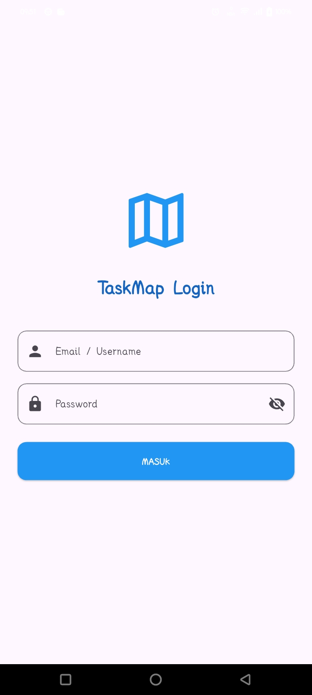
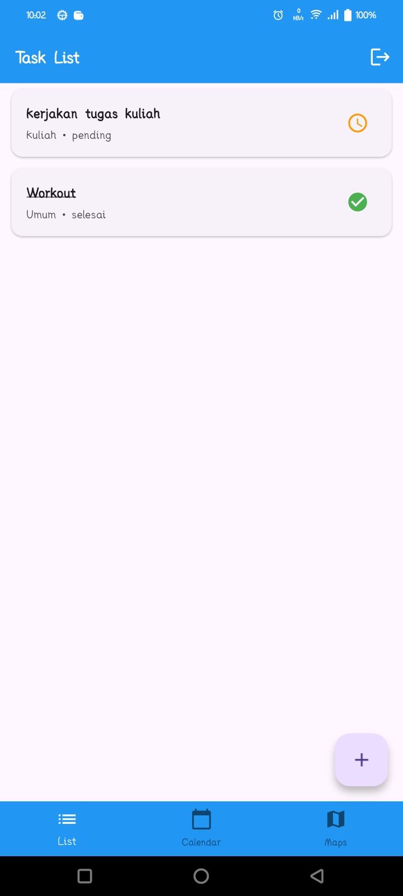
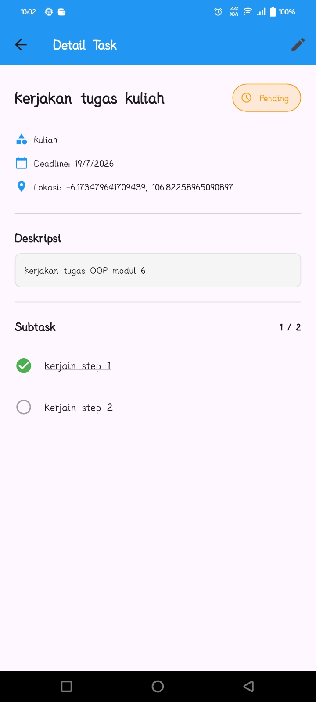
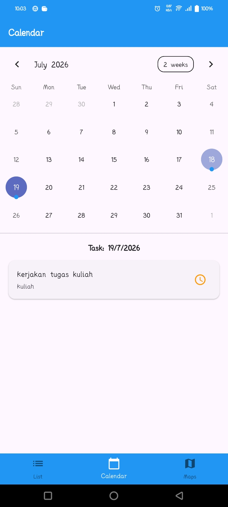
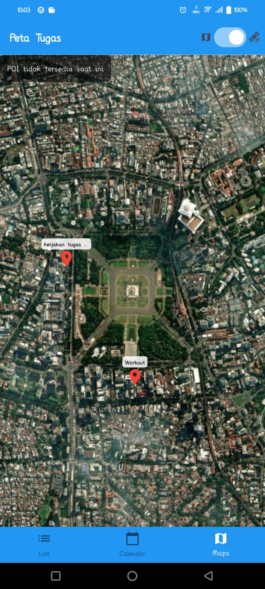
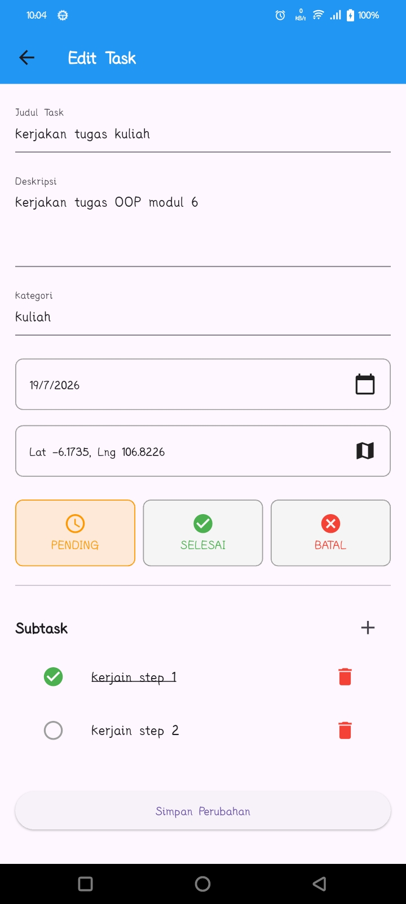

# 📱 TaskMap — Location-Based Task Management App

> A mobile productivity application built with **Flutter** that helps users organize tasks through **List**, **Calendar**, and **Map** views using location-based task management.

---

## 📸 Preview

| Home | Task List | Task Detail |
|------|-----------|-------------|
|  |  |  |

| Calendar | Map | Task Edit |
|----------|-----|-----------|
|  |  |  |

---

## 📖 About

TaskMap is a mobile task management application designed to help users organize and track daily activities more effectively.

Unlike traditional to-do list applications, TaskMap integrates **location-based task management**, allowing users to associate tasks with specific places and visualize them on an interactive map.

The project focuses on building an intuitive user experience while exploring mobile development with Flutter, local data persistence, and map integration.

---

## 🎯 Why This Project?

This project was built to:

- Practice Flutter application development
- Explore local database management
- Implement location-based features
- Improve mobile UI/UX design skills
- Build a real-world productivity application

---

## 🔥 Highlights

- Location-based task management
- Interactive map integration using OpenStreetMap
- Multiple task views (List, Calendar, and Map)
- Clean and responsive mobile interface

---

## ✨ Features

### Task Management

- Create, update, and delete tasks
- Mark tasks as completed
- Search and filter tasks
- Task priority management *(Planned)*

### Categories

- Organize tasks by category
- Custom category colors
- Category filtering

### Calendar

- Monthly calendar view
- Daily task overview
- Task scheduling

### Maps

- Add task locations
- View tasks on an interactive map
- OpenStreetMap integration

### Productivity

- Task reminders *(Planned)*
- Statistics *(Planned)*
- Offline support

---

## 🛠 Technology Stack

| Category | Technology |
|----------|------------|
| Language | Dart |
| Framework | Flutter |
| Database | SQLite |
| Maps | Flutter Map |
| Map Provider | OpenStreetMap |
| State Management | Provider |
| Location | Geolocator |

---

## 🏛 Application Flow

TaskMap follows a simple workflow that helps users organize tasks based on both time and location.

```text
Create Task
      │
      ▼
Assign Category
      │
      ▼
Select Location
      │
      ▼
Save Task
      │
      ▼
View Task
 ├── List View
 ├── Calendar View
 └── Map View
```

---

## 📂 Project Structure

```text
lib
│
├── models              # Data Models
├── screens             # Application Pages
├── widgets             # Reusable Widgets
├── services            # Business Services
├── providers           # State Management
├── database            # SQLite Configuration
└── utils               # Utilities & Helpers
```

---

## 💡 Key Concepts

This project applies several mobile development concepts:

- Flutter Widget Tree
- State Management
- Local Database (SQLite)
- Location Services
- OpenStreetMap Integration
- Responsive UI Design
- Clean Code Principles

---

## 🚀 Getting Started

### Prerequisites

- Flutter SDK
- Android Studio or VS Code
- Android Emulator or Physical Device

### 1. Clone Repository

```bash
git clone https://github.com/Kambing-Gunung/TaskMap.git
```

### 2. Install Dependencies

```bash
flutter pub get
```

### 3. Run Application

```bash
flutter run
```

---

## 🗺️ Roadmap

- [x] Task CRUD
- [x] Category Management
- [x] Calendar View
- [x] Map Integration
- [ ] Notification Reminder
- [ ] Cloud Synchronization
- [ ] User Authentication
- [ ] Dark Mode
- [ ] Widget Support

---

## 📄 License

This project is developed for educational and portfolio purposes.